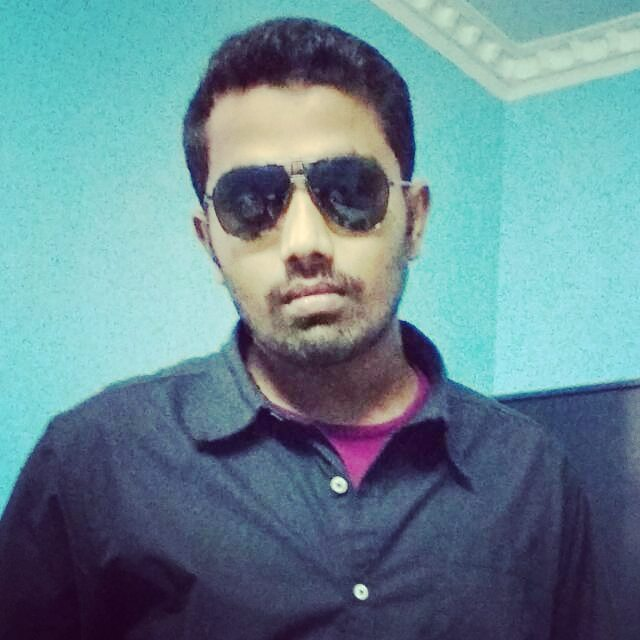

I am a software professional working in Informatica - Business Intelligence. I am based in Chennai, India and work for Tata Consultancy Services as System Engineer.
you're viewing my personal blog based website where i scribble my thoughts, learnings and my life journal.

I always wanted to be a computer freak, and that was happened to me in 2007. Post graduation in Embedded system and graduation in Electronics & communication made me enough to deal with this Sci-Fi society.

Learning. Loving. Dreaming. Hoping. Praying.

## Social

- [Twitter](http://twitter.com/imbhartesh) — Tweets
- [Instagram](http://instagram.com/imbhartesh/) — SnapShots
- [Flickr](http://www.flickr.com/photos/imbhartesh/) — Life Moments
- [Facebook](http://www.facebook.com/iambhartesh) — Request me

### [ @imbhartesh](http://twitter.com/imbhartesh)
